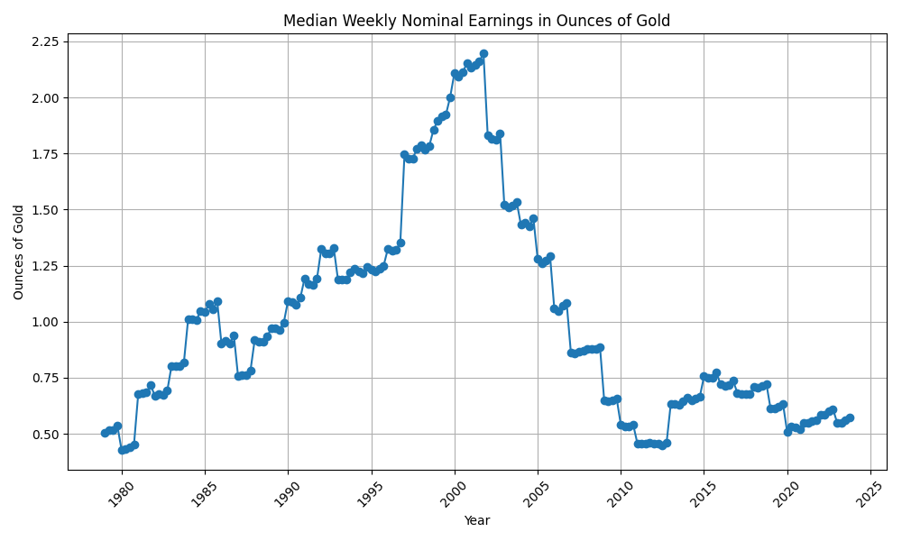

# American-Real-Wages
U.S.A. median wages over time normalized to ounces of gold

### Data sources
Gold/USD price data for 1950-2017 was sourced from [datahub.io](https://datahub.io/core/gold-prices). Gold/USD price data for 2018-2023 was sourced from [goldprice.org](https://goldprice.org/gold-price-history.html). I also crosschecked the price history against data from [macrotrends.net](https://www.macrotrends.net/1333/historical-gold-prices-100-year-chart) to ensure it was broadly accurate.

The median wage data came from the St. Louis Federal Reserve: [Employed full time: Median usual weekly nominal earnings (second quartile): Wage and salary workers: 16 years and over](https://fred.stlouisfed.org/series/LEU0252881500Q)

##### Rationale for using gold to normalize nominal -> real wages
I'm not a goldbug bug I think gold is a reasonable proxy for real wages. Gold is unambiguous (it's an element on the periodic table), it has good price data available, and the ratio of gold to the price of other goods and services stays relatively stable over time.
